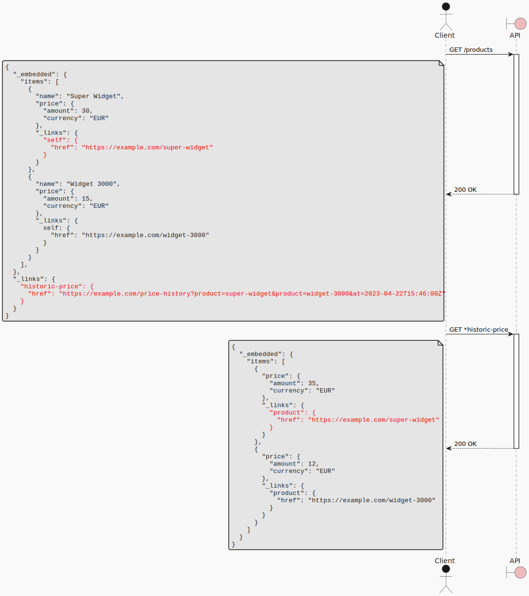

Often, there is some information related to a resource that is slow to produce;
for this reason, you want to make it optional to get, or defer fetching it to achieve faster [Largest Contentful Paint (LSP)](https://web.dev/articles/lcp).

> # How can I expose additional data about a resource while making the original resource fast to fetch?
> Use an Overlay Resource, which is a separate resource whose data can be overlaid, i.e., used to enrich the origin resource.

# Sequence Diagram



# Example client code

```jsx
const Product = ({product, historicPrice}) => {
  return (
    <span>{product.name}</span>
    <span>{formatPrice(product.price)}</span>
    {historicPrice
      ? <PriceDiff
          current={product.price}
          historic={historicPrice}
        />
      : null}
  );
};
const ProductList = () => {
  const [productList, setProductList] = useState([]);
  const [historicPrices, setHistoricPrices] = useState({})
  
  useEffect(() => {
    const products = await get("/products");
    setProductList(products);
  });
  
  useEffect(() => {
    if (productList) {
      const oldPrices = await get(productList._links['historic-price'].href);
      setHistoricPrices(oldPrices);
    }
  }, [productList]);
  
  return (<ol>{productList.map(p => 
    <li>
      <Product
        product={p}
        historicPrice={historicPrices[p._links.self.href]}
       />
   </li>)}
  </ol>);
};
```

# Properties

## Strengths

### Faster LCP

Since the response to the initial request is smaller, its latency is reduced and clients can perform some work sooner (e.g. rendering part of a component).

## Weaknesses

### Imposes more client complexity

Extracting some data into a separate resource implies that clients need to make two separate requests to get all of it, which increases client complexity.
Additionally, for collections, clients need to perform matching between the origin items and the overlay items, which could be a significant source of additional complexity.

### Higher end-to-end latency

The two requests required by the pattern imply an Round Trip Time (RTT) penalty in terms of latency when compared to using a single request.

### Larger use of bandwidth

# Alternatives

## [Toggle Params][toggle-params-pattern]

With [Toggle Params][toggle-params-pattern], you can introduce a query param that, when set, returns the additional data in the same response as the original resource.

Also, using [Toggle Params][toggle-params-pattern] requires the server to fetch all of the data at once, which increases latency for the first request.

[toggle-params-pattern]: toggle_params
