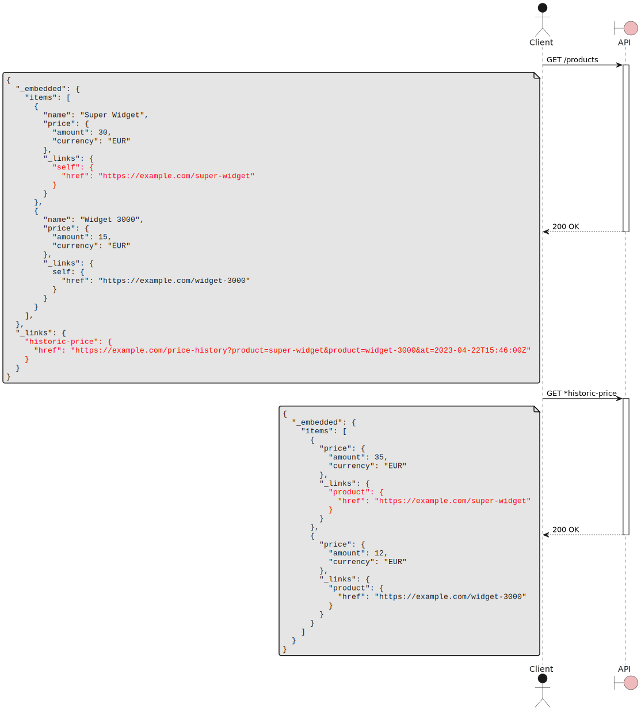

Often, there is some information related to a resource that is expensive to produce and that clients aren't always interested in;
for this reason, you want to make it optional to get.

> # How can I expose additional data about a resource while optimizing cache use?
> Use an Overlay Resource, which is a separate resource whose data can be overlayed, i.e., used to enrich the origin resource.

This is especially helpful for collections where the overlay performs a bulk fetch.
# Sequence Diagram



# Example client code

```jsx
const Product = ({product, historicPrice}) => {
  return (
    <span>{product.name}</span>
    <span>{formatPrice(product.price)}</span>
    {historicPrice
      ? <PriceDiff
          current={product.price}
          historic={historicPrice}
        />
      : null}
  );
};
const ProductList = () => {
  const [productList, setProductList] = useState([]);
  const [historicPrices, setHistoricPrices] = useState({})
  
  useEffect(() => {
    const products = await get("/products");
    setProductList(products);
  });
  
  useEffect(() => {
    if (productList) {
      const oldPrices = await get(productList._links['historic-price'].href);
      setHistoricPrices(oldPrices);
    }
  }, [productList]);
  
  return (<ol>{productList.map(p => 
    <li>
      <Product
        product={p}
        historicPrice={historicPrices[p._links.self.href]}
       />
   </li>)}
  </ol>);
};
```

# Properties
## Strengths
### Faster time to first render
Since the response to the initial request can be made smaller, its latency is reduced and clients can perform some work sooner (e.g. rendering part of a component).
### Good caching behavior
Moving the optional data into another resource makes the origin resource's URI and response the same for all clients, regardless of whether they perform the additional fetch;
if the origin resource is a [Shared Resource][shared-resource-pattern], it can be easily cached to improve latency.
## Weaknesses
### Imposes more client complexity
Extracting some data into a separate resource implies that clients need to make two separate requests to get all of it, which increases client complexity.
Additionally, for collections, clients need to perform matching between the origin items and the overlay items, which could be a significant source of additional complexity.
### Higher end-to-end latency
The two requests required by the pattern imply an RTT penalty in terms of latency when compared to using a single request.
### Larger use of bandwidth

# Alternatives
## [Toggle Params][toggle-params-pattern]
With [Toggle Params][toggle-params-pattern], you can introduce a query param that, when set, performs the additional fetch.
However, doing this causes the URI to change, making it harder to use [Resource Caching][resource-caching-pattern].
Also, using [Toggle Params][toggle-params-pattern] requires the server to fetch all of the data at once, which increases latency for the first request.

[resource-caching-pattern]: resource_caching
[shared-resource-pattern]: shared_resource
[toggle-params-pattern]: toggle_params
