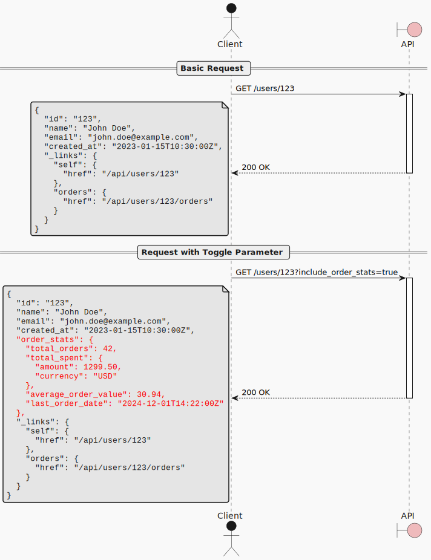

When exposing resources through an API, there are often related pieces of data that are expensive to compute or fetch, such as aggregated statistics, related resources, or computed fields.
Including all this data by default can make responses slow and unnecessarily large for clients that don't need it.

> # How can clients selectively request additional data to be included in a response without requiring separate API calls?
> Use Toggle Parameters as query parameters that control whether additional data is fetched and added to the response alongside the original data.

Toggle Parameters allow clients to opt-in to including expensive or optional data in a single request,reducing the number of round trips while keeping the default response fast and minimal.

# Sequence Diagram

# Properties

## Strengths

### Flexibility

Provides an explicit mechanism for trading off performance and fetching additional information.

### Reliability

Issues a single request, which makes it more resilient to transient issues like network partitions.

### Extensibility

Multiple toggle parameters can be added without breaking clients.

## Weaknesses

### Potentially complex server implementation

Cyclomatic complexity of the server implementation rises with the number of parameters.

### Coupling

Clients can only support toggles by:

* using out-of-band knowledge, i.e., building the URL is baked into the client implementation;
* using a hypermedia format that is more complex, in order to support forms.

# Related Patterns

## [Overlay Resource][overlay-resource-pattern]

Alternative approach using separate endpoints for additional data. While Toggle Parameters include optional data in a single request, Overlay Resources split the data across multiple endpoints for better performance control.

[overlay-resource-pattern]: overlay_resource
